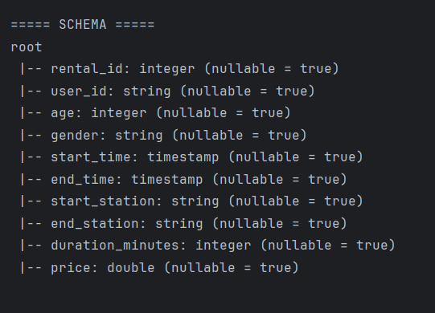
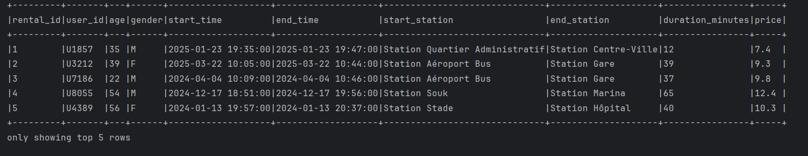
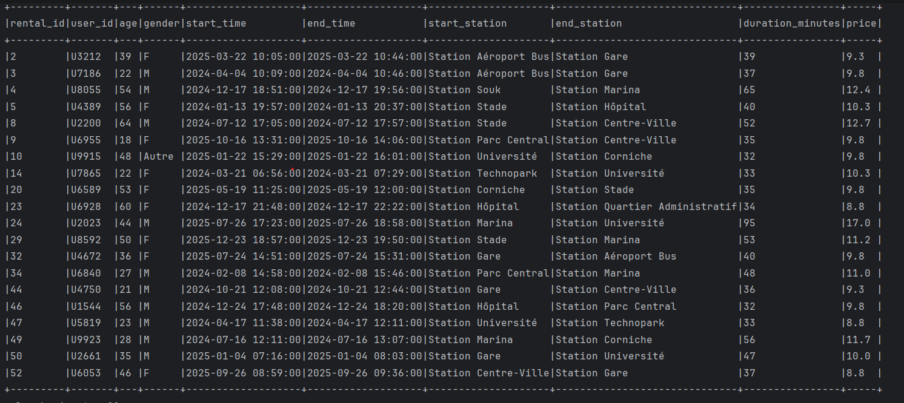
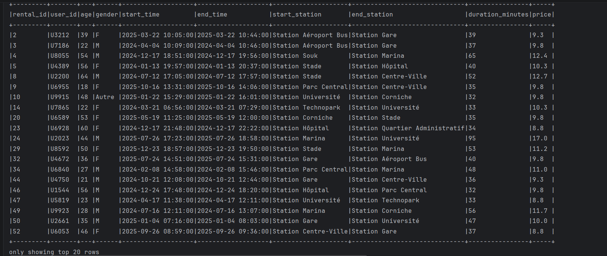
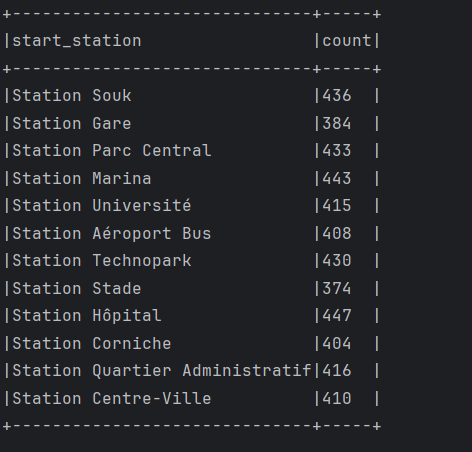
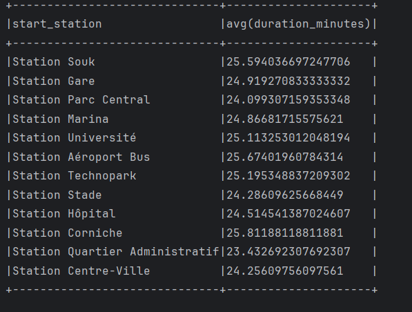
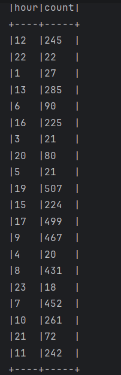
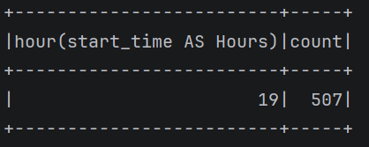
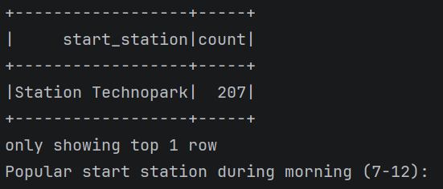
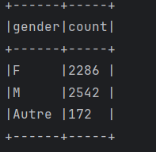

# Université : ENSET Mohammedia

## Module : Big Data – Spark SQL

### Réalisé par : Bouchra RAFIK
### Encadré par : Abdelmajid BOUSSELHAM

---

# Activité Pratique : Spark SQL

## Présentation générale

Ce travail pratique porte sur l'utilisation de **Apache Spark SQL** pour analyser un jeu de données de location de vélos en libre-service. L'application est développée en **Java** avec l'API `SparkSession` et les `Dataset<Row>`. Les données sont chargées depuis un fichier CSV, interrogées via l'API DataFrame et via des requêtes SQL pures grâce à une vue temporaire.

L'objectif est de maîtriser les principales fonctionnalités de Spark SQL : chargement, exploration, filtrage, agrégation, analyse temporelle et analyse comportementale des utilisateurs.

---

## Jeu de données

Le fichier `resources/rentals.csv` contient **5 000 enregistrements** de locations de vélos avec les colonnes suivantes :

| Colonne             | Type      | Description                          |
|---------------------|-----------|--------------------------------------|
| `rental_id`         | Integer   | Identifiant unique de la location    |
| `user_id`           | String    | Identifiant de l'utilisateur         |
| `age`               | Integer   | Âge de l'utilisateur                 |
| `gender`            | String    | Genre (M / F / Autre)                |
| `start_time`        | Timestamp | Date et heure de début               |
| `end_time`          | Timestamp | Date et heure de fin                 |
| `start_station`     | String    | Station de départ                    |
| `end_station`       | String    | Station d'arrivée                    |
| `duration_minutes`  | Integer   | Durée de la location en minutes      |
| `price`             | Double    | Prix en dirhams                      |

---

## Partie 1 – Chargement et exploration des données

### 1.1 Schéma du DataFrame

Après chargement du fichier CSV avec l'option `inferSchema`, Spark déduit automatiquement le type de chaque colonne. Le schéma inféré est le suivant :



> Le schéma comporte 10 colonnes couvrant les informations de l'utilisateur (`user_id`, `age`, `gender`), les horodatages (`start_time`, `end_time`), les stations (`start_station`, `end_station`), ainsi que les métriques de la location (`duration_minutes`, `price`). Toutes les colonnes autorisent les valeurs nulles (`nullable = true`), ce qui est le comportement par défaut lors de l'inférence de schéma depuis un CSV.

---

### 1.2 Aperçu des 5 premières lignes

La méthode `show(5, false)` affiche les 5 premiers enregistrements sans tronquer les valeurs :



> On observe que les locations proviennent de différentes stations (Quartier Administratif, Aéroport Bus, Souk, Stade), avec des durées et des prix variables. Les données couvrent les années 2024 et 2025.

---

### 1.3 Nombre total de locations

Le comptage total du DataFrame avec `rentals.count()` donne :


> Le jeu de données contient exactement **5 000 locations**, ce qui constitue un volume représentatif pour une analyse statistique fiable.

---

## Partie 2 – Création d'une vue temporaire

Une vue temporaire SQL nommée `bike_rentals_view` est créée avec la méthode `createOrReplaceTempView`. Cette vue permet d'interroger le DataFrame via du SQL standard.

```java
rentals.createOrReplaceTempView("bike_rentals_view");
```

> La vue temporaire reste accessible pendant toute la durée de la session Spark. Elle n'est pas persistée sur disque et disparaît à la fin de l'exécution. Ce mécanisme est central dans Spark SQL : il permet de basculer librement entre l'API DataFrame et le SQL déclaratif sur le même ensemble de données.

---

## Partie 3 – Requêtes SQL de base

### 3.1 Locations de plus de 30 minutes

Sélection de toutes les locations dont la durée dépasse 30 minutes :

```sql
SELECT *
FROM bike_rentals_view
WHERE duration_minutes > 30
```



> Ce filtre isole les locations longues durée, qui sont souvent associées à des trajets touristiques ou à des distances plus importantes entre stations. Ces locations génèrent généralement des revenus plus élevés.

---

### 3.2 Locations depuis la Station Aéroport Bus

Sélection de toutes les locations ayant démarré depuis la station « Station Aeroport Bus » :

```sql
SELECT *
FROM bike_rentals_view
WHERE start_station = 'Station Aeroport Bus'
```



> Cette station est particulièrement fréquentée, ce qui s'explique par sa position stratégique à proximité des transports en commun. Les utilisateurs l'empruntent souvent pour rejoindre d'autres points de la ville.

---

### 3.3 Revenu total généré

Calcul du revenu total en sommant la colonne `price` sur l'ensemble des locations :

```sql
SELECT ROUND(SUM(price), 2) AS total_revenue
FROM bike_rentals_view
```


> Le service génère un revenu total de **41 755,70 DH** sur l'ensemble du jeu de données. Rapporté aux 5 000 locations, cela représente un prix moyen d'environ **8,35 DH** par location.

---

## Partie 4 – Requêtes d'agrégation

### 4.1 Nombre de locations par station de départ

Regroupement des locations par `start_station` avec comptage :

```java
rentals.groupBy("start_station").count().show(false);
```



> Les 12 stations affichent des volumes d'utilisation relativement proches, oscillant entre 374 (Station Stade) et 447 (Station Hôpital). Cela traduit une répartition géographique équilibrée du réseau de stations.

---

### 4.2 Durée moyenne de location par station

Calcul de la durée moyenne (en minutes) des locations pour chaque station de départ :

```java
rentals.groupBy("start_station")
       .avg("duration_minutes")
       .show(false);
```



> Toutes les stations présentent une durée moyenne comprise entre **23 et 26 minutes**. La Station Quartier Administratif affiche la durée moyenne la plus basse (~23,4 min), tandis que la Station Corniche présente la plus élevée (~25,8 min), ce qui peut s'expliquer par des trajets plus longs depuis les zones récréatives.

---

### 4.3 Station la plus populaire

Tri décroissant du nombre de locations par station et affichage du premier résultat :

```java
rentalsPerStation
    .orderBy(col("count").desc())
    .show(1, false);
```


> La **Station Hôpital** est la station de départ la plus utilisée avec **447 locations**. Sa position dans une zone à fort passage (établissement hospitalier, accès aux transports) explique cette popularité.

---

## Partie 5 – Analyse temporelle

### 5.1 Extraction de l'heure de début

Extraction de l'heure depuis la colonne `start_time` à l'aide de la fonction `hour()` :

```java
rentals.select(
    col("start_time"),
    hour(col("start_time")).alias("hour")
).show(false);
```


> La fonction `hour()` de Spark extrait la composante heure (0-23) d'un timestamp. On observe des locations réparties sur toutes les tranches horaires de la journée, avec des heures variées allant du matin tôt (6h) jusqu'en soirée (19h).

---

### 5.2 Nombre de locations par heure

Regroupement par heure de début et comptage :

```java
Dataset<Row> perHour =
    rentals.groupBy(hour(col("start_time")).alias("hour"))
           .count();
perHour.show(false);
```



> La distribution horaire révèle des pics d'utilisation nets. L'heure 19 (19h-20h) enregistre le volume le plus élevé avec 507 locations, suivie de 17h (499) et 9h (467), correspondant aux heures de pointe du soir et du matin.

---

### 5.3 Heure de pointe

Identification de l'heure avec le plus grand nombre de locations :

```java
perHour.orderBy(col("count").desc())
       .show(1, false);
```



> L'**heure de pointe est 19h** avec **507 locations**. Ce résultat est cohérent avec les habitudes de déplacement urbain : les usagers utilisent majoritairement les vélos en fin de journée pour rentrer chez eux ou se déplacer après le travail.

---

### 5.4 Station la plus populaire le matin (7h–12h)

Filtrage des locations sur la plage horaire matinale et identification de la station dominante :

```java
rentals.withColumn("hour", hour(col("start_time")))
       .filter(col("hour").between(7, 12))
       .groupBy("start_station")
       .count()
       .orderBy(col("count").desc())
       .show(1, false);
```



> Entre 7h et 12h, la **Station Technopark** est la plus fréquentée avec **207 départs**. Cela suggère un flux important de travailleurs du secteur technologique se rendant à leur lieu de travail tôt le matin.

---

## Partie 6 – Analyse du comportement des utilisateurs

### 6.1 Âge moyen des utilisateurs

Calcul de la moyenne de la colonne `age` sur l'ensemble du dataset :

```java
rentals.select(avg("age").alias("avg_age"))
       .show(false);
```


> L'âge moyen des utilisateurs est de **41,52 ans**. Cela indique que le service est principalement utilisé par une population adulte d'âge moyen, ce qui peut orienter les stratégies de communication et de tarification.

---

### 6.2 Répartition des utilisateurs par genre

Comptage des locations groupées par genre :

```java
rentals.groupBy("gender")
       .count()
       .show(false);
```



> La répartition montre une légère prédominance masculine : **2 542 locations** effectuées par des hommes (M), **2 286** par des femmes (F), et **172** par des utilisateurs de la catégorie « Autre ». Le service est néanmoins utilisé de façon relativement équilibrée entre les deux genres principaux.

---

### 6.3 Locations par groupe d'âge

Segmentation des utilisateurs en groupes d'âge via une expression `CASE WHEN` en SQL :

```sql
SELECT
    CASE
        WHEN age BETWEEN 18 AND 30 THEN '18-30'
        WHEN age BETWEEN 31 AND 40 THEN '31-40'
        WHEN age BETWEEN 41 AND 50 THEN '41-50'
        ELSE '51+'
    END AS age_group,
    COUNT(*) AS total
FROM bike_rentals_view
GROUP BY age_group
ORDER BY total DESC
```


> Le groupe **51+** représente la tranche la plus active avec **1 567 locations**, suivi des **18-30 ans** (1 362). Les tranches intermédiaires **41-50** (1 054) et **31-40** (1 017) sont moins représentées. Ce résultat, contre-intuitif, suggère que les seniors et les jeunes adultes constituent les principaux utilisateurs du service, peut-être pour des raisons de mobilité douce ou de loisirs.

---

## Conclusion

Ce travail pratique a permis d'explorer de manière approfondie les capacités de **Apache Spark SQL** pour l'analyse de données massives à travers un cas concret de location de vélos en libre-service.

L'analyse d'un jeu de données de **5 000 locations** a mis en évidence plusieurs résultats significatifs :

- Le service génère un **revenu total de 41 755,70 DH**, avec une durée moyenne de location autour de **25 minutes** quelle que soit la station.
- La **Station Hôpital** est la plus fréquentée en termes de départs, et la **Station Technopark** domine le créneau matinal (7h-12h).
- L'**heure de pointe se situe à 19h** avec 507 locations, révélant un usage majoritairement lié aux déplacements domicile-travail en fin de journée.
- La clientèle est légèrement dominée par les **hommes (50,8%)** et par le groupe des **51 ans et plus**, avec un âge moyen de 41,5 ans.

Ces résultats pourraient servir de base à des décisions opérationnelles : rééquilibrage des vélos entre stations aux heures de pointe, ciblage marketing par tranche d'âge, ou encore ajustement de la tarification selon les horaires.

---

## Ce que j'ai appris

Ce TP m'a permis d'acquérir et de consolider les compétences suivantes :

| Compétence | Description |
|---|---|
| **Initialisation de SparkSession** | Configurer et démarrer une session Spark en mode local avec `SparkSession.builder()` |
| **Chargement de données CSV** | Lire un fichier CSV avec inférence automatique du schéma (`inferSchema`) via l'API DataFrame |
| **Exploration de données** | Utiliser `printSchema()`, `show()`, et `count()` pour explorer rapidement un Dataset |
| **Vues temporaires SQL** | Créer une vue temporaire avec `createOrReplaceTempView()` et l'interroger en SQL pur |
| **Requêtes SQL dans Spark** | Écrire et exécuter des requêtes SQL via `spark.sql()` incluant `SELECT`, `WHERE`, `GROUP BY`, `ORDER BY` |
| **API DataFrame** | Utiliser les méthodes `groupBy()`, `count()`, `avg()`, `orderBy()`, `filter()`, `withColumn()` |
| **Fonctions temporelles** | Extraire l'heure depuis un timestamp avec la fonction `hour()` de `org.apache.spark.sql.functions` |
| **Expressions conditionnelles** | Construire des segments avec `CASE WHEN ... THEN ... END` pour créer des groupes d'âge |
| **Agrégations** | Calculer des métriques (somme, moyenne, comptage) sur des données groupées |
| **Analyse de données réelles** | Interpréter des résultats statistiques et en tirer des conclusions métier pertinentes |
